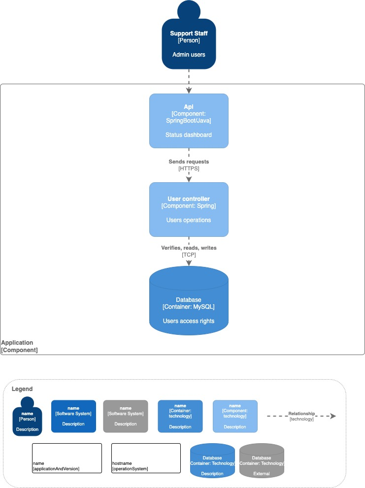

# nisum-spring-boot-app



Minimal [Spring Boot](http://projects.spring.io/spring-boot/) nisum app with clean architecture.

## Requirements

For building and running the application you need:

- [JDK 17](https://adoptium.net/es/temurin/releases/?package=jdk)
- [Maven 3](https://maven.apache.org)
- [Lombok plugin](https://projectlombok.org/)

## Running the application locally

There are several ways to run a Spring Boot application on your local machine. One way is to execute the `main` method in the `com.alvarez.kd.nisum.NisumApplication` class from your IDE.

Alternatively you can use the [Spring Boot Maven plugin](https://docs.spring.io/spring-boot/docs/current/reference/html/build-tool-plugins-maven-plugin.html) like so:

```shell
./mvnw spring-boot:run
```

## Run with docker

Build image and run container:

```shell
docker build -t nisum . 
```

```shell 
docker run -d -p 8080:8080 --name nisumkalvarez nisum
```

## Examples curl

Get the list of registered users

```shell
curl --location 'localhost:8080/v1/users'
```

Register user

```shell
curl --location 'localhost:8080/v1/users' \
--header 'Content-Type: application/json' \
--data-raw '{
	"name": "Juan Rodriguez",
	"email": "juan2@rodriguez.org",
	"password": "Hunter2@",
	"phones": [{
		"number": "1234567",
		"cityCode": "1",
		"countryCode": "57"
	},
    {
		"number": "3454654",
		"cityCode": "13",
		"countryCode": "51"
	}]
}'
```

Disable user, replace {id}

```shell
curl --location --request POST 'localhost:8080/v1/users/{id}/disable'
```


## Copyright

Nisum 2025
